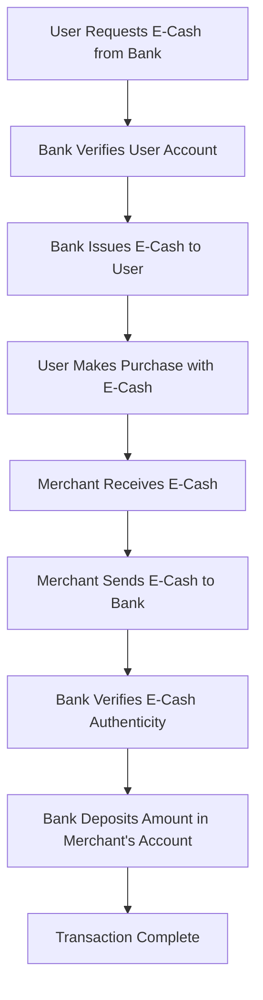

# **Suggestions**  

---

## **Short Questions**

**What is the main difference between a firewall and an antivirus?**  
A firewall monitors and controls network traffic, preventing unauthorized access, while an antivirus detects and removes malware from a system.  

**Is a firewall a software or hardware?**  
A firewall can be both software (installed on devices) or hardware (dedicated network security appliances).  

**What are the 4C’s in e-commerce?**  
The 4C’s are **Convergence, Collaborative Computing, Content Management, and Call Center.**  

**How does convergence impact e-commerce?**  
Convergence integrates computing, telecommunications, and multimedia, allowing seamless communication and data sharing in e-commerce.  

**What is collaborative computing in e-commerce?**  
It involves multiple users working together on shared data and applications, such as collaborative product development and contract management.  

**What is the role of content management in e-commerce?**  
It deals with creating, managing, and distributing digital content, including web traffic management and content marketing.  

**How does a call center support e-commerce businesses?**  
A call center handles customer inquiries, complaints, and sales, improving customer support and satisfaction.  

**What are the different types of E-Logistics?**  
E-Logistics includes **Inbound Logistics, Outbound Logistics, Reverse Logistics, and Third-Party Logistics (3PL).**  

**How does e-commerce impact logistics operations?**  
E-commerce increases demand for faster delivery, real-time tracking, warehouse automation, and global supply chain integration.  

**What is the transaction flow in an E-Cash system?**  
It involves user authentication, digital wallet selection, payment processing, verification by the merchant, and transaction completion.  

**What are the key steps in an RSA system?**  
RSA involves selecting prime numbers, computing the modulus, generating public and private keys, encrypting messages, and decrypting them.  

**How do you calculate public and private keys in RSA?**  
Public key is $(e, n)$, where $n = p \times q$, and private key is $(d, n)$, where $d$ is computed using modular inverse of $e$.  

**What are the components of EDI software?**  
EDI includes **Standards, Protocols, Communication Networks, and Security Mechanisms** to facilitate electronic transactions.  

**What are the key features of EDI?**  
EDI automates business transactions, reduces paperwork, improves efficiency, and ensures secure data exchange.  

**How does EDI improve business transactions?**  
It speeds up order processing, reduces human errors, and enhances supply chain management.  

**What is the difference between symmetric and asymmetric cryptography?**  
Symmetric cryptography uses a single key for encryption and decryption, while asymmetric cryptography uses a public-private key pair.  

**Which cryptography method uses a single key for encryption and decryption?**  
Symmetric key cryptography, such as AES and DES, uses one key for both encryption and decryption.  

**What is the advantage of asymmetric cryptography over symmetric cryptography?**  
Asymmetric cryptography provides secure key exchange without needing a shared secret key, making it more secure for communications.  

**What is C2C e-commerce?**  
Consumer-to-Consumer (C2C) e-commerce involves individuals selling products or services directly to other consumers via online platforms.  

**Give an example of a C2C e-commerce platform.**  
eBay, OLX, and Facebook Marketplace are popular C2C platforms where users buy and sell items.  

**What is the importance of web security in e-commerce?**  
Web security protects sensitive data, prevents cyber threats, and ensures safe online transactions.  

**How do digital signatures enhance security in e-commerce?**  
Digital signatures verify the authenticity and integrity of online transactions, preventing fraud and data tampering.  

**What role does encryption play in online payments?**  
Encryption secures financial transactions by encoding sensitive data, ensuring confidentiality and security.  

**What are the threats to e-commerce security?**  
Threats include phishing, hacking, malware attacks, identity theft, and data breaches.  

**What is a digital certificate in cryptography?**  
A digital certificate is an electronic document issued by a Certificate Authority (CA) that verifies the identity of a website or user.  

**What is E-Governance in e-commerce?**  
E-Governance refers to using electronic platforms to deliver government services, improve transparency, and enhance public administration.  

**How does an EDI transaction take place?**  
EDI transactions occur through standardized electronic documents exchanged between businesses over secure networks.  

**What are the benefits of ERP in business?**  
ERP improves business efficiency, automates workflows, integrates departments, and enhances data-driven decision-making.  

**What is the role of SAP in ERP?**  
SAP provides enterprise resource planning software that integrates business processes like finance, HR, and supply chain management.  

---

## **1. Write the difference between firewall and antivirus? Is firewall a software or hardware?**  

**Ans:**  

### **Definition:**  
- **Firewall:** A security system that monitors and controls incoming and outgoing network traffic based on predefined security rules.  
- **Antivirus:** A software program designed to detect, prevent, and remove malware, including viruses, worms, and trojans.  

---

### **Comparison Table**  

| Feature       | Firewall | Antivirus |  
|--------------|---------|-----------|  
| **Function**  | Monitors and controls network traffic | Detects and removes malicious software |  
| **Protection Type** | Prevents unauthorized access | Protects against viruses, malware, spyware |  
| **Scope** | Network-level security | File and system-level security |  
| **Detection Method** | Filters incoming and outgoing traffic based on rules | Scans files for virus signatures and suspicious behavior |  
| **Types** | Hardware or software | Only software |  
| **Real-time Monitoring** | Yes, continuously monitors network traffic | Yes, continuously scans files and programs |  
| **User Control** | Allows or blocks traffic based on rules | Quarantines or deletes infected files |  
| **Examples** | Windows Firewall, Cisco ASA, pfSense | Norton, McAfee, Avast, Windows Defender |  

---

### **Is a Firewall a Software or Hardware?**  
A firewall can be:  
- **Software-based**: Installed on an operating system (e.g., Windows Firewall).  
- **Hardware-based**: A dedicated physical device (e.g., Cisco ASA, Fortinet).  

Firewalls provide **network security**, while antivirus software protects against **malicious programs** at the system level.

---

## **2. List 4C's in E-Commerce? Describe Each.**  

**Ans:**  

The **4C’s** in e-commerce are **Convergence, Collaborative Computing, Content Management, and Call Center.** These elements play a crucial role in enhancing the efficiency and effectiveness of e-commerce operations.  

---

### **1. Convergence**  
**Definition:** Convergence refers to the merging of different technologies, such as computing, telecommunications, and multimedia, to provide seamless services.  

**Key Aspects:**  
- Integrates **IT, communication, and media** for enhanced digital experiences.  
- Enables **multi-device accessibility**, improving consumer interaction.  
- Supports **cross-platform operations**, ensuring continuity of services.  
- Enhances **business automation** and data-sharing processes in e-commerce.  

**Example:** A single e-commerce platform accessible via **web browsers, mobile apps, and smart devices**.  

---

### **2. Collaborative Computing**  
**Definition:** Collaborative computing involves multiple users working together on shared data and applications to enhance productivity and efficiency.  

**Key Aspects:**  
- Allows **real-time collaboration** in product development and supply chain management.  
- Supports **simultaneous teamwork**, reducing project turnaround time.  
- Integrates **cloud-based tools** (e.g., Google Workspace, Microsoft Teams).  
- Enhances **security and contract management** in e-commerce transactions.  

**Example:** Online platforms where multiple vendors manage and update inventory **simultaneously**.  

---

### **3. Content Management**  
**Definition:** Content management involves creating, storing, managing, and distributing digital content efficiently to enhance customer engagement.  

**Key Aspects:**  
- Uses **content authoring tools** for creating digital content.  
- Implements **SEO strategies** to improve website visibility.  
- Manages **repositories** to store and organize content for easy retrieval.  
- Includes **web traffic monitoring** and **content marketing** to attract and retain customers.  

**Example:** Amazon’s **recommendation system**, which displays personalized product listings based on browsing history.  

---

### **4. Call Center**  
**Definition:** A call center provides customer support through voice, email, chat, or other digital communication channels.  

**Key Aspects:**  
- Handles **customer inquiries, complaints, and support requests**.  
- Operates via **inbound and outbound communication** channels.  
- Uses **Customer Premises Equipment (CPE)** to manage interactions efficiently.  
- Enhances **customer service** and boosts brand reputation.  

**Example:** **Flipkart’s 24/7 customer service** that helps users track orders, process returns, and resolve issues.  

---

### **Conclusion:**  
The **4C’s** – **Convergence, Collaborative Computing, Content Management, and Call Centers** – are essential components of modern e-commerce, ensuring smooth operations, enhanced customer engagement, and better business outcomes.

---

## **3. Classify the types of E-Logistics? Explain the impact of E-Commerce on Logistics.**  

**Ans:**  

### **Types of E-Logistics:**  
E-Logistics refers to the management of logistics operations using digital technologies. The main types include:  

- **Inbound Logistics**: Manages the procurement and transportation of raw materials from suppliers to manufacturers.  
- **Outbound Logistics**: Involves the distribution of finished goods from warehouses to customers.  
- **Reverse Logistics**: Handles returns, exchanges, and recycling of products from customers to the seller or manufacturer.  
- **Third-Party Logistics (3PL)**: Companies outsource logistics functions such as warehousing, transportation, and inventory management to external providers.  
- **Fourth-Party Logistics (4PL)**: Integrates and manages multiple logistics providers to optimize supply chain efficiency.  
- **Last-Mile Delivery**: Focuses on delivering goods from distribution centers to the end customer, ensuring quick and efficient service.  

### **Impact of E-Commerce on Logistics:**  
E-Commerce has transformed logistics by introducing faster, more efficient, and technology-driven supply chain solutions:  

- **Automation & Digitalization**: Use of AI, IoT, and automation for real-time tracking, warehouse management, and route optimization.  
- **Increased Customer Expectations**: Demand for faster delivery, same-day shipping, and real-time order tracking has reshaped logistics operations.  
- **Rise of Warehousing & Fulfillment Centers**: E-commerce companies establish regional warehouses to reduce delivery time and costs.  
- **Advanced Inventory Management**: Technologies like RFID and cloud-based inventory tracking enhance accuracy and efficiency.  
- **Growth of Third-Party Logistics (3PL & 4PL)**: Businesses rely on external logistics partners for efficient delivery and supply chain management.  
- **Sustainability Initiatives**: Adoption of eco-friendly packaging, electric delivery vehicles, and optimized routes to reduce carbon footprints.

---

## **4. Draw a flowchart showing transaction flow in an E-Cash System.**  

**Ans:**  

### **Definition of E-Cash System**  
E-Cash (Electronic Cash) is a **digital currency** that allows users to make secure transactions over the internet. It functions like physical cash but is stored electronically and can be transferred between users and merchants without the need for a third-party intermediary.

### **Transaction Flow in an E-Cash System**  
The **E-Cash transaction process** involves the following steps:  

1. **User Requests E-Cash** – A customer requests digital cash from their bank.  
2. **Bank Verifies User Account** – The bank checks the user's balance and authentication.  
3. **Bank Issues E-Cash** – After verification, the bank deducts the amount and issues encrypted e-cash.  
4. **User Makes Purchase** – The user uses the e-cash to pay for goods or services online.  
5. **Merchant Receives E-Cash** – The seller receives the digital payment from the customer.  
6. **Merchant Sends E-Cash to Bank** – The merchant deposits the received e-cash into their bank account.  
7. **Bank Verifies E-Cash** – The bank checks the authenticity of the e-cash to prevent fraud or double-spending.  
8. **Bank Deposits Amount in Merchant’s Account** – After verification, the equivalent amount is credited to the merchant's account.  
9. **Transaction Complete** – The payment process is successfully completed.  

### **Flowchart Representation**  

This flowchart clearly represents how **E-Cash transactions** take place from issuance to final settlement with the merchant.

---

## **5. Given two prime numbers 31 and 29, design an RSA system. Explain with an example how it works.**

**Ans:**

### **Step 1: Choose Two Prime Numbers (\( p \) & \( q \))**
Given:
\( p = 31 \)
\( q = 29 \)

### **Step 2: Compute \( n \) (Modulus)**
\( n = p \times q = 31 \times 29 = 899 \)
\( n \) is used as the modulus for both public and private keys.

### **Step 3: Compute \( \phi(n) \) (Euler’s Totient Function)**
\( \phi(n) = (p-1) \times (q-1) = (31-1) \times (29-1) = 30 \times 28 = 840 \)

### **Step 4: Choose Public Key \( e \)**
\( e \) should be \( 1 < e < \phi(n) \) and \( \gcd(e, \phi(n)) = 1 \).
Let’s choose \( e = 7 \) (as \( \gcd(7, 840) = 1 \)).

### **Step 5: Compute Private Key \( d \)**
\( d \) is the modular multiplicative inverse of \( e \) modulo \( \phi(n) \), meaning:
\( d \times e \equiv 1 \pmod{\phi(n)} \)
Using the Extended Euclidean Algorithm,
\( d = 721 \)
(since \( 7 \times 721 = 5047 \equiv 1 \pmod{840} \)).

### **Step 6: RSA Key Pair**
- **Public Key:** \( (e, n) = (7, 899) \)
- **Private Key:** \( (d, n) = (721, 899) \)

---

### **Example: Encryption & Decryption**
Let’s encrypt the message \( M = 5 \).

#### **Encryption Formula:**
\( C = M^e \mod n \)
\( C = 5^7 \mod 899 \)
\( C = 78125 \mod 899 = 626 \)
Thus, the **ciphertext** is **626**.

#### **Decryption Formula:**
\( M = C^d \mod n \)
\( M = 626^{721} \mod 899 \)
Using modular exponentiation,
\( M = 5 \)
Thus, the **original message is recovered** successfully.

This demonstrates how RSA encryption and decryption work using the given prime numbers. 

---

## **6. Explain EDI Software and EDI Components.**  

**Ans:**  

### **Definition of EDI (Electronic Data Interchange)**  
Electronic Data Interchange (EDI) is the automated exchange of business documents in a standardized electronic format between organizations. It eliminates paper-based transactions and improves efficiency, accuracy, and speed.  

---

### **EDI Software**  
EDI software enables businesses to send and receive structured electronic documents such as invoices, purchase orders, and shipping notices. It translates data between different formats and integrates it into enterprise systems.  

#### **Types of EDI Software:**  
- **On-Premises EDI** – Installed within an organization’s infrastructure.  
- **Cloud-Based EDI** – Hosted on cloud platforms, allowing remote access.  
- **EDI via VAN (Value-Added Network)** – Uses third-party networks for secure communication.  
- **Web-Based EDI** – Allows small businesses to exchange EDI documents via a web interface.  

---

### **EDI Components**  

| Component | Description |  
|-----------|------------|  
| **EDI Standards** | Defines document formats (e.g., ANSI X12, EDIFACT, TRADACOMS). |  
| **EDI Translator** | Converts business data into EDI format and vice versa. |  
| **EDI Communication Protocols** | Ensures secure data exchange (e.g., AS2, FTP, HTTP, VAN). |  
| **EDI Mapping** | Transforms data between internal applications and EDI format. |  
| **EDI Gateway** | Manages inbound and outbound EDI messages. |  
| **EDI Integration** | Connects EDI software with ERP, CRM, and other business systems. |  

EDI streamlines transactions, reduces errors, and enhances supply chain efficiency by enabling seamless electronic communication between businesses.

---

## **7. Compare Symmetric & Asymmetric Key Cryptography**  

**Ans:**  

### **Definition:**  
- **Symmetric Key Cryptography**: Uses the same key for both encryption and decryption.  
- **Asymmetric Key Cryptography**: Uses a pair of keys (public and private) for encryption and decryption.  

---

### **Comparison Table**  

| Feature | Symmetric Key Cryptography | Asymmetric Key Cryptography |  
|---------|--------------------------|----------------------------|  
| **Keys Used** | Single key for encryption & decryption | Public key for encryption, private key for decryption |  
| **Speed** | Faster due to simpler computations | Slower due to complex mathematical operations |  
| **Security** | Less secure (key must be shared) | More secure (private key is never shared) |  
| **Key Distribution** | Difficult (requires a secure method to share the key) | Easier (public key can be shared openly) |  
| **Usage** | Used for encrypting large amounts of data | Used for secure communication (e.g., digital signatures, SSL/TLS) |  
| **Examples** | AES, DES, 3DES | RSA, ECC, Diffie-Hellman |  

---

### **Usage Scenarios**  
- **Symmetric Key Cryptography**: Used in bulk data encryption, secure file storage, and VPNs.  
- **Asymmetric Key Cryptography**: Used in digital signatures, secure email, and HTTPS encryption.

---

## **8. Explain C2C E-Commerce with an Appropriate Example**  

**Ans:**  

### **Definition of C2C E-Commerce**  
Consumer-to-Consumer (C2C) e-commerce refers to online transactions where consumers sell products or services directly to other consumers, typically through third-party platforms. These platforms provide a marketplace, payment services, and dispute resolution.  

---

### **Characteristics of C2C E-Commerce**  
- Direct transactions between consumers.  
- Platforms act as intermediaries (e.g., eBay, OLX).  
- Users can buy or sell new or used products.  
- Payments handled through secure gateways.  

---

### **Example of C2C E-Commerce**  
A person wants to sell a used smartphone. They list it on **eBay**, providing images, descriptions, and pricing. Another consumer interested in purchasing the phone places an order and makes an online payment. The seller ships the item, and once the buyer confirms receipt, the payment is finalized.  

**Platforms facilitating C2C E-Commerce:**  
- **eBay** – Auction-based and direct sales.  
- **OLX** – Localized selling and buying.  
- **Etsy (for handmade goods)** – Consumer artisans selling to other consumers.  

C2C e-commerce enables individuals to monetize unused goods, creating a second-hand market with minimal business involvement.

---